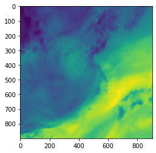
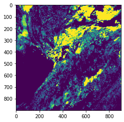
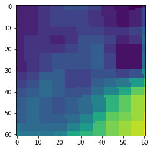
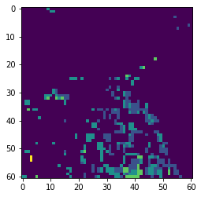

# Seomjingang_Rainfall_Prediction
섬진강 유역 강우량 예측 모델

### 팀 구성 및 역할

2인 팀 프로젝트

- 기상, 수위, 지형 데이터 수집 및 정제 (기여도 100%)
- 섬진강 유역 강우량 예측 모델 설계 (기여도 30%)

### **기획 의도**

- AIFactory 인공지능 경진대회 출전
- 섬진강 유역의 위성 이미지 자료와 12 개의 지상관측소 강수량 데이터를 이용해 Machine Learning / Deep Learning Model을 생성하여 섬진강 유역내의 강수량 예측 모델 개발

### 개발 환경

- 언어 : Python
- Tools : Pytorch
- 활용 라이브러리 : EfficientNet, Simpledbf, Rasterio, netCDF4, Pandas, Numpy, Matplotlib

---

### **데이터 수집**

- (2020년 1월 1일 01시 ~ 2021년 6월 30일 23시)의 섬진강 유역 위성 데이터(천리안2A호/TPW(가강수량), 천리안2A호/RR(강우강도), NASA GPM/IMERG)
- 각 영상 픽셀의 위치와 지상 관측소의 위도, 경도 정보
- 기상청 제공 지상(종관) 기상자료(구름, 습도, 기온 등) / 공공데이터포털 OPEN API 활용

### EDA 및 데이터 전처리

- TPW(가강수량), RR(강우강도) 기상 데이터를 활용하기 위해 netCDF4 라이브러리를 활용합니다.

                          TPW

                              RR

- 천리안 인공위성의 한반도 전역 이미지 지리정보를 처리하기 위해 DBF5 라이브러리를 활용합니다.
    
    추가적으로, 전체 데이터 중 이번 과제에서 필요한 섬진강 유역 이미지 지리정보만 크롭하여 활용하기 위해 지상관측소의 위도, 경도 데이터를 참고하여 좌상단, 우하단 (min, max)값 내의 천리안 이미지 지리 정보만을 추출하여 사용합니다. 
    
    
    

                 Cropped TPW

                     Cropped RR

- GPM 지리 데이터를 활용하기위해 rasterio, georasters 라이브러리를 활용합니다.

- 국내 위성, 기상 데이터는 1시간 간격으로 조사된 데이터임에 반해, NASA 위성 데이터는 30분 단위의 데이터 이므로 시간 간격을 1시간으로 통일하여 처리하였습니다.
- GPM 자료명이 UTC+0 기준으로 되어 있으므로, 이를 국내 위성 데이터의 관측 표준시에 맞추어 UTC+9으로 변환해 주었습니다.
- 결측값 처리
    - 기상데이터는 연속적으로 변화하는 데이터 이므로 전/후 데이터가 결측값을 예측하는데에 활용될 수 있다는 가정
    - Linear Interpolation 방법(전/후 데이터의 Mean 값)으로 결측값 대체
- Outlier는 주변 지역의 데이터의 Min, Max, Mean, Q1, Q3 값을 참고하여 1.5 IQR 이상 차이가 나는 데이터를 기준으로 삭제 처리 하였습니다.

### 결과

RMSE Score : **1.633**

- **9위**/49팀

### 추가 사항

- 결측치 처리시, Regression을 수행하기 위한 머신러닝/딥러닝을 수행하여 보다 정확한 값을 예측하여 넣음으로써 결과를 더욱 향상시킬 수 있습니다.
- 신경망 하이퍼 파라미터값의 튜닝과정에서 더욱 많은 실험 수행함으로써 최적값을 산출해내어 결과를 더욱 향상 시킬 수 있습니다.
